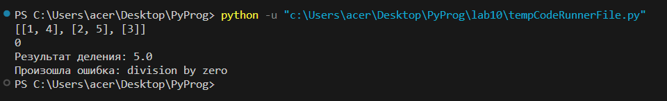
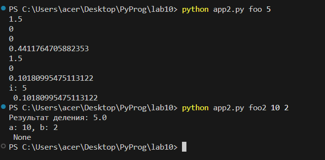
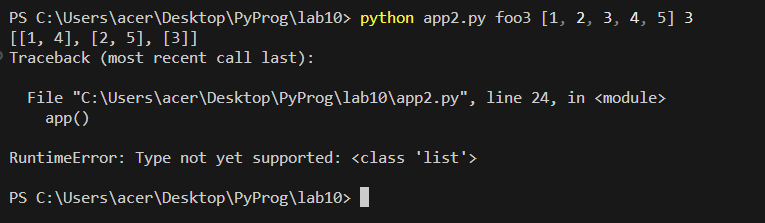

# PyProg
# Задание

```
Сложность:  Rare
1. Создайте пакет, содержащий 3 модуля на основе лабораторных работ № 7-9
2. Напишите запускающий модуль на основе Typer, который позволит выбирать и настраивать параметры запуска логики из пакета.
3. Оформите отчёт в README.md. Отчёт должен содержать:
    Условия задач
    Описание проделанной работы
    Скриншоты результатов
    Ссылки на используемые материалы
```

## Ход работы
* Пункт 1. Сначала я перенес модули из лабораторных работ № 7-9 в папку `superpack`(так и будет называться пакет). Затем я создал еще модуль `__init__.py`. Это нужно чтобы все работало нормально.

Ну и тестируем. 
```python
from superpack.app_7_ import split
from superpack.main_7_ import func
from superpack.main2_8_ import divide
```

* Пункт 2. Мои модули

`main_7_.py`:
```python
def func(i):
    if i == 1:
        print(0)
        return 0
    elif i == 2:
        print(0)
        return 0
    elif i == 3:
        print(1.5)
        return 1.5
    else:
        A = (i+1)/((i*i)+1) * func(i-1) - func(i-2) * func(i-3)
        print(A)
        return A
```

`main2_8_.py`:

```python
def A(func):
    def wrapper(*args, **kwargs): # внутри этой функции оборачиваем вызов исходной функции func в блок try-except
        try:
            return func(*args, **kwargs)
        except Exception as e:  # можно указать конкретные типы исключений
            print(f"Произошла ошибка: {e}")
    
    return wrapper

@A
def divide(a, b):
    result = a / b
    print(f"Результат деления: {result}")
```

`app_7_.py`:
```python
lst = [1,2,3,4,5]

def split(lst, n):
    return [lst[i::n] for i in range(n)]

print(split(lst, 3))
```

## Запускающий модуль на основе Typer

```python 
import typer

from superpack import main2_8_
from superpack import main_7_
from superpack import app_7_

app = typer.Typer()


@app.command()
def foo(i: int):
    print(f'i: {i}\n', main_7_.func(i))


@app.command()
def foo2(a: int, b: int):
    print(f'a: {a}, b: {b}\n', main2_8_.divide(a, b))

@app.command()
def foo3(lst: list, n: int):
    print(f'lst: {lst}, n: {n}\n', app_7_.split(lst, n))

if __name__ == "__main__":
    app()
```

## Результаты (Пункт 1)


Как видите все рабоатет. 

## Результаты (Пункт 2)





Со списком не получается запустить. Не поддерживается такой тип данных `list` вроде.

## Список использованных источников
1. [Создание пакетов](https://sky.pro/media/kak-sozdat-i-ispolzovat-pakety-v-python/)