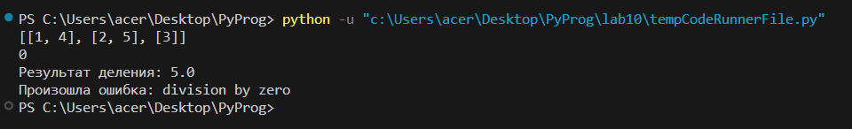

# PyProg
# Задание

```
Сложность:  Rare
1. Создайте пакет, содержащий 3 модуля на основе лабораторных работ № 7-9
2. Напишите запускающий модуль на основе Typer, который позволит выбирать и настраивать параметры запуска логики из пакета.
3. Оформите отчёт в README.md. Отчёт должен содержать:
    Условия задач
    Описание проделанной работы
    Скриншоты результатов
    Ссылки на используемые материалы
```

Выполнен только 1 пункт. Со вторым пунктом проблемы(не понятно как это все должно работать).

## Ход работы
Сначала я перенес модули из лабораторных работ № 7-9 в папку `superpack`(так и будет называться пакет). Затем я создал еще модуль `__init__.py`. Это нужно чтобы все работало нормально.

Ну и тестируем. 
```python
from superpack.app_7_ import split
from superpack.main_7_ import func
from superpack.main2_8_ import divide
```

## Результаты


Как видите все рабоатет. 

## Список использованных источников
1. [Создание пакетов](https://sky.pro/media/kak-sozdat-i-ispolzovat-pakety-v-python/)