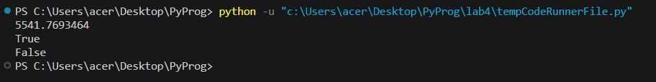
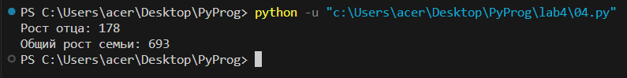

# PyProg

## Задание 
Сложность:
    Medium 
        
        Напишите верхнеуровневый модуль, который будет использовать логику из модулей-заданий. Перед этим нужно будет придумать способ инкапсулировать логику для корректного импортирования.

## Отчет

### Код 
#### logic01.py
```python
class Logic:
    def __init__(self):
        self.pi = 3.1415926
        self.r = 42
        self.S = self.pi * self.r ** 2
    
    def calculate_area(self):
        return self.S
    
    def check_distance(self, point):
        distance = (point[0] ** 2 + point[1] ** 2) ** 0.5
        return distance <= self.r
```
#### 01.py
```python 
from logic01 import Logic

logic = Logic()
print(logic.calculate_area())

point_1 = (23, 34)
print(logic.check_distance(point_1))

point_2 = (30, 30)
print(logic.check_distance(point_2))
```

#### Результат



#### logic04.py

```python
class Family:
    def __init__(self, member_names, member_heights):
        self.members = member_names
        self.heights = member_heights
    
    def get_member_height(self, member_name):
        # Ищем соответствующую высоту члена семьи
        index = self.members.index(member_name)
        height = self.heights[index]
        return height
    
    def get_total_height(self):
        # Суммируем все значения в списке heights
        total_height = sum(self.heights)
        return total_height
```

#### 04.py

```python
from logic04 import Family

# Создаем экземпляр класса Family
my_family = Family(['Mother', 'Father', 'Brother', 'I'], [173, 178, 160, 182])

# Получаем и выводим высоту члена семьи 'Father'
father_height = my_family.get_member_height('Father')
print('Рост отца:', father_height)

# Вычисляем и выводим общую сумму всех высот в семье
total_height = my_family.get_total_height()
print('Общий рост семьи:', total_height)
```

#### Результат



### Список использованных источников
1. [Классы](https://www.youtube.com/watch?v=esSIFatS6kM)