# PyProg

## Задание 
Сложность:
    Rare
        
        Скачайте архив и распакуйте его в свой репозиторий. В нём 11 заданий, которые вам нужно выполнить.
        Оформите отчёт в README.md. По каждому из заданий - описание задачи, скриншот работы программы.

## Отчет

## 00.py

Есть словарь координат городов

Составить словарь словарей расстояний между ними


```
sites = {
    'Moscow': (550, 370),
    'London': (510, 510),
    'Paris': (480, 480),
}

distances = dict()

m = sites['Moscow']
l = sites['London']
p = sites['Paris']

Moscow_London = ((m[0] - l[0]) ** 2 + (m[1] - l[1]) ** 2) ** 0.5
Moscow_Paris = ((m[0] - p[0]) ** 2 + (m[1] - p[1]) ** 2) ** 0.5
London_Moscow = ((l[0] - m[0]) ** 2 + (l[1] - m[1]) ** 2) ** 0.5
London_Paris = ((l[0] - p[0]) ** 2 + (l[1] - p[1]) ** 2) ** 0.5
Paris_Moscow = ((p[0] - m[0]) ** 2 + (p[1] - m[1]) ** 2) ** 0.5
Paris_London = ((p[0] - l[0]) ** 2 + (p[1] - l[1]) ** 2) ** 0.5

distances['Moscow'] = {}
distances['Moscow']['London'] = Moscow_London
distances['Moscow']['Paris'] = Moscow_Paris

distances['London'] = {}
distances['London']['Moscow'] = London_Moscow
distances['London']['Paris'] = London_Paris

distances['Paris'] = {}
distances['Paris']['Moscow'] = Paris_Moscow
distances['Paris']['London'] = Paris_London

result = {'Moscow-London': distances['Moscow']['London'], 'London-Paris': distances['London']['Paris'], 'Paris-Moscow': distances['Paris']['Moscow']}

print(result)
```

### Результат работы программы

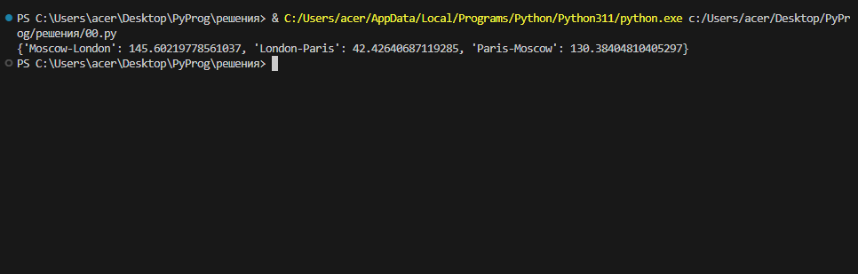 


## 01.py

1) Есть значение радиуса круга

Выведите на консоль значение прощади этого круга с точностю до 4-х знаков после запятой

2) Далее, пусть есть координаты точки `point_1 = (23, 34)`

Если точка point лежит внутри того самого круга [центр в начале координат (0, 0), radius = 42] , то выведите на консоль True, Или False, если точка лежит вовне круга

3) Аналогично для другой точки `point_2 = (30, 30)`

```
# 1
pi = 3.1415926
r = 42
S = pi * r ** 2
print('s = ', S)

# 2 
point_1 = (23, 34)
point_0 = (0, 0)
# формула (x – x0)^2 + (y – y0)^2 = r^2
# x0 = 0; y0 = 0 => x^2 + y^2 = r^2 (r = 42)
rastoyanie = (point_1[0] ** 2 + point_1[1] ** 2) ** 0.5
print(rastoyanie <= S)

# 3
point_2 = (30, 30)
point_0 = (0, 0)
rastoyanie2 = (point_1[0] ** 2 + point_1[1] ** 2) ** 0.5
print(rastoyanie2 <= S)
```
### Результат работы программы

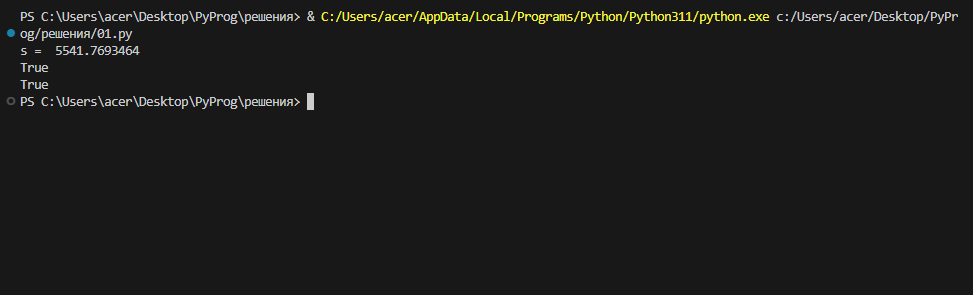 

## 02.py

Расставьте знаки операций "плюс", "минус", "умножение" и скобки между числами "1 2 3 4 5" так, что бы получилось число "25".

Использовать нужно только указанные знаки операций, но не обязательно все перечесленные.

Порядок чисел нужно сохранить.

```
result = ((1 + 2) * 3 - 4) * 5
print('Otvet: ', result)
```

### Результат работы программы

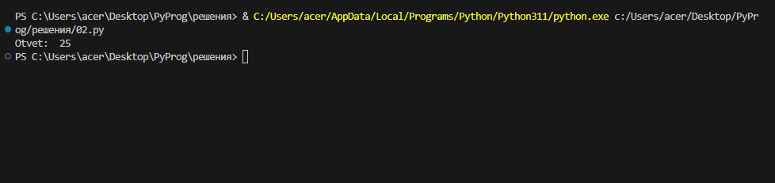 

## 03.py

Есть строка с перечислением фильмов

Выведите на консоль с помощью индексации строки, последовательно:
   первый фильм
   последний
   второй
   второй с конца

Запятая не должна выводиться

```
my_favorite_movies = 'Терминатор, Пятый элемент, Аватар, Чужие, Назад в будущее'

first =  my_favorite_movies [0:10]
last = my_favorite_movies [42:57]
second = my_favorite_movies [12:25]
second2 = my_favorite_movies [35:40]
print(first, last, second, second2, sep="\n")
```

### Результат работы программы

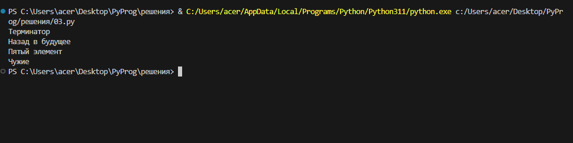 

## 04.py

Создайте списки:

Моя семья (минимум 3 элемента, есть еще дедушки и бабушки, если что)

Список списков приблизителного роста членов вашей семьи

Выведите на консоль рост отца в формате
   Рост отца - ХХ см


Выведите на консоль общий рост вашей семьи как сумму ростов всех членов
   Общий рост моей семьи - ХХ см

```
my_family = ['Mother', 'Father', 'Brother', 'I']

Mother = my_family[0]
Father = my_family[1]
Brother = my_family[2]
I = my_family[3]

my_family_height = [['Mother', 173], ['Father', 178], ['Brother', 160], ['I', 182]]
print(my_family_height[1])

print(my_family_height[0][1] + my_family_height[1][1] +my_family_height[2][1] +my_family_height[3][1])
```

### Результат работы программы

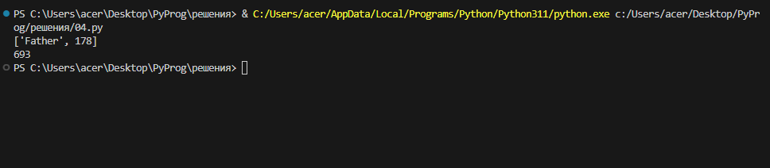 

## 05.py

Есть список животных в зоопарке

Посадите медведя (bear) между львом и кенгуру
  и выведите список на консоль

Добавьте птиц из списка birds в последние клетки зоопарка и выведите список на консоль

Выведите на консоль в какой клетке сидит лев (lion) и жаворонок (lark).

Номера при выводе должны быть понятны простому человеку, не программисту.

```
# 1
zoo = ['lion', 'kangaroo', 'elephant', 'monkey']
zoo.insert(1, 'bear')
print(zoo)

# 2
birds = ['rooster', 'ostrich', 'lark']
zoo.extend(birds)
print(zoo)

# 3 
zoo.remove('elephant')
print(zoo)

# 4 
print("Lion v kletke № " + str(zoo.index('lion')+1))
print("Lark v kletke № " + str(zoo.index('lark')+1))
```

### Результат работы программы

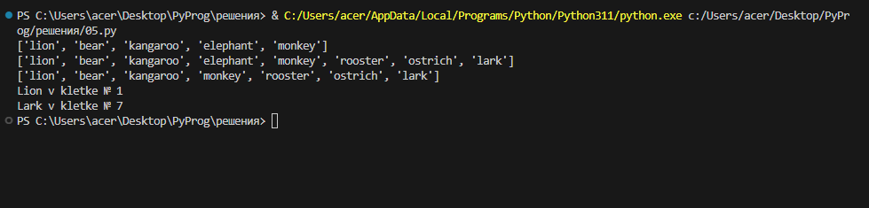 

## 06.py

Есть список песен группы Depeche Mode со временем звучания с точностью до долей минут

Точность указывается в функции `round(a, b)`, где a, это число которое надо округлить, а b количество знаков после запятой

распечатайте общее время звучания трех песен: 'Halo', 'Enjoy the Silence' и 'Clean' в формате
    
    Три песни звучат ХХХ.XX минут

Обратите внимание, что делать много вычислений внутри print() - плохой стиль.

Лучше заранее вычислить необходимое, а затем в print(xxx, yyy, zzz)

Есть словарь песен группы Depeche Mode

```
violator_songs_list = [
    ['World in My Eyes', 4.86],
    ['Sweetest Perfection', 4.43],
    ['Personal Jesus', 4.56],
    ['Halo', 4.9],
    ['Waiting for the Night', 6.07],
    ['Enjoy the Silence', 4.20],
    ['Policy of Truth', 4.76],
    ['Blue Dress', 4.29],
    ['Clean', 5.83],
]

time = violator_songs_list[3][1] + violator_songs_list[5][1] + violator_songs_list[8][1]
print('Три песни звучат '  + str(round(time, 2)) + ' минут')
```

### Результат работы программы

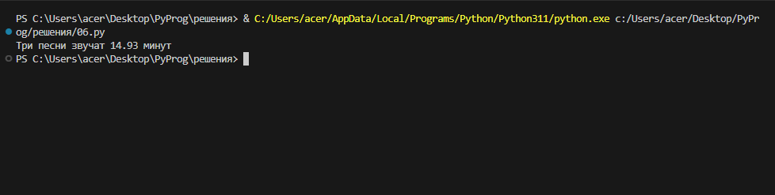 

## 07.py

Есть зашифрованное сообщение

Нужно его расшифровать и вывести на консоль в удобочитаемом виде.

Должна получиться фраза на русском языке

```
secret_message = [
    'квевтфпп6щ3стмзалтнмаршгб5длгуча',
    'дьсеы6лц2бане4т64ь4б3ущея6втщл6б',
    'т3пплвце1н3и2кд4лы12чф1ап3бкычаь',
    'ьд5фму3ежородт9г686буиимыкучшсал',
    'бсц59мегщ2лятьаьгенедыв9фк9ехб1а',
]


word1 = secret_message[0][3]
word2 = secret_message[1][9:13]
word3 = secret_message[2][5:15:2]
word4 = secret_message[3][12:6:-1]
word5 = secret_message[4][20:15:-1]
print(word1, word2, word3, word4, word5)
```

### Результат работы программы

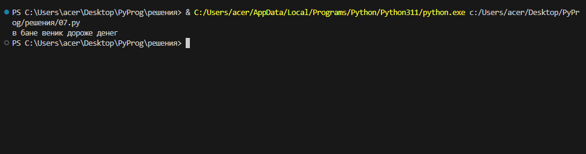

## 08.py

В саду сорвали цветы

На лугу сорвали цветы

Создайте множество цветов, произрастающих в саду и на лугу

Выведите на консоль все виды цветов

Выведите на консоль те, которые растут и там и там

Выведите на консоль те, которые растут в саду, но не растут на лугу

Выведите на консоль те, которые растут на лугу, но не растут в саду

```
garden = ('ромашка', 'роза', 'одуванчик', 'ромашка', 'гладиолус', 'подсолнух', 'роза', )

meadow = ('клевер', 'одуванчик', 'ромашка', 'клевер', 'мак', 'одуванчик', 'ромашка', )

garden_set = set(garden)
meadow_set = set(meadow)

# 1 
print(garden_set)
print(meadow_set)

# 2 
print(garden_set & meadow_set)

# 3
print(garden_set - meadow_set)

# 4
print(meadow_set - garden_set)
```

### Результат работы программы

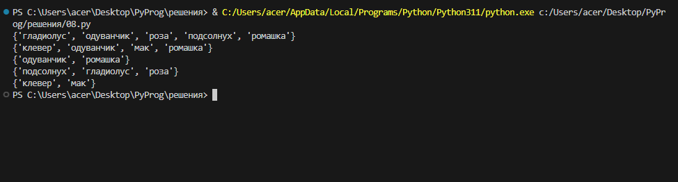

## 09.py

Есть словарь магазинов с распродажами

Создайте словарь цен на продкты следующего вида (писать прямо в коде)

Указать надо только по 2 магазина с минимальными ценами

```
shops = {
    'ашан':
        [
            {'name': 'печенье', 'price': 10.99},
            {'name': 'конфеты', 'price': 34.99},
            {'name': 'карамель', 'price': 45.99},
            {'name': 'пирожное', 'price': 67.99}
        ],
    'пятерочка':
        [
            {'name': 'печенье', 'price': 9.99},
            {'name': 'конфеты', 'price': 32.99},
            {'name': 'карамель', 'price': 46.99},
            {'name': 'пирожное', 'price': 59.99}
        ],
    'магнит':
        [
            {'name': 'печенье', 'price': 11.99},
            {'name': 'конфеты', 'price': 30.99},
            {'name': 'карамель', 'price': 41.99},
            {'name': 'пирожное', 'price': 62.99}
        ],
}

# цены
sweets = {
    'печенье': [
        {'shop': 'пятерочка', 'price': 9.99},
        {'shop': 'ашан', 'price': 10.99}
    ],
    
    'конфеты': [
        {'shop': 'пятерочка', 'price': 32.99},
        {'shop': 'магнит', 'price': 30.99}
    ],
    
    'карамель': [
        {'shop': 'магнит', 'price': 41.99},
        {'shop': 'ашан', 'price': 45.99}
    ],
    
    'пирожное': [
        {'shop': 'пятерочка', 'price': 59.99},
        {'shop': 'магнит', 'price': 62.99}
    ],
}

print(sweets)
```

### Результат работы программы

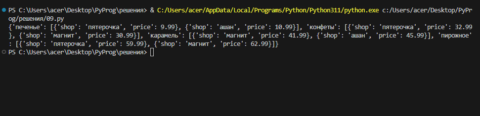

## 10.py

Есть словарь кодов товаров

Есть словарь списков количества товаров на складе

Рассчитать на какую сумму лежит каждого товара на складе

Вывести стоимость каждого вида товара на складе:

Один раз распечать сколько всего столов и их общая стоимость,

Один раз распечать сколько всего стульев и их общая стоимость, и т.д. на складе

Формат строки <товар> - <кол-во> шт, стоимость <общая стоимость> руб

```
goods = {
    'Лампа': '12345',
    'Стол': '23456',
    'Диван': '34567',
    'Стул': '45678',
}

store = {
    '12345': [
        {'quantity': 27, 'price': 42},
    ],
    '23456': [
        {'quantity': 22, 'price': 510},
        {'quantity': 32, 'price': 520},
    ],
    '34567': [
        {'quantity': 2, 'price': 1200},
        {'quantity': 1, 'price': 1150},
    ],
    '45678': [
        {'quantity': 50, 'price': 100},
        {'quantity': 12, 'price': 95},
        {'quantity': 43, 'price': 97},
    ],
}

lamps_cost = store[goods['Лампа']][0]['quantity'] * store[goods['Лампа']][0]['price']
lamp_code = goods['Лампа']
lamps_item = store[lamp_code][0]
lamps_quantity = lamps_item['quantity']
lamps_price = lamps_item['price']
lamps_cost = lamps_quantity * lamps_price
print('Лампа -', lamps_quantity, 'шт, стоимость', lamps_cost, 'руб')


tables_quantity_1 = store[goods['Стол']][0]['quantity']
tables_quantity_2 = store[goods['Стол']][1]['quantity']
tables_quantity = tables_quantity_1 + tables_quantity_2
tables_price_1 = store[goods['Стол']][0]['price']
tables_price_2 = store[goods['Стол']][1]['price']
tables_cost = (tables_quantity_1 * tables_price_1) + (tables_quantity_2 * tables_price_2)
print('Стол -', tables_quantity, 'шт., стоимость', tables_cost, 'руб.')


sofas_quantity_1 = store[goods['Диван']][0]['quantity']
sofas_quantity_2 = store[goods['Диван']][1]['quantity']
sofas_quantity = sofas_quantity_1 + sofas_quantity_2
sofas_price_1 = store[goods['Диван']][0]['price']
sofas_price_2 = store[goods['Диван']][1]['price']
sofas_cost = (sofas_quantity_1 * sofas_price_1) + (sofas_quantity_2 * sofas_price_2)
print('Диван -', sofas_quantity, 'шт., стоимость', sofas_cost, 'руб.')


chairs_quantity_1 = store[goods['Стул']][0]['quantity']
chairs_quantity_2 = store[goods['Стул']][1]['quantity']
chairs_quantity_3 = store[goods['Стул']][2]['quantity']
chairs_quantity = chairs_quantity_1 + chairs_quantity_2 + chairs_quantity_3
chairs_price_1 = store[goods['Стул']][0]['price']
chairs_price_2 = store[goods['Стул']][1]['price']
chairs_price_3 = store[goods['Стул']][2]['price']
chairs_cost = (chairs_quantity_1 * chairs_price_1) + (chairs_quantity_2 * chairs_price_2) + (chairs_quantity_3 * chairs_price_3)
print('Стул -', chairs_quantity, 'шт., стоимость', chairs_cost, 'руб.')
```

### Результат работы программы

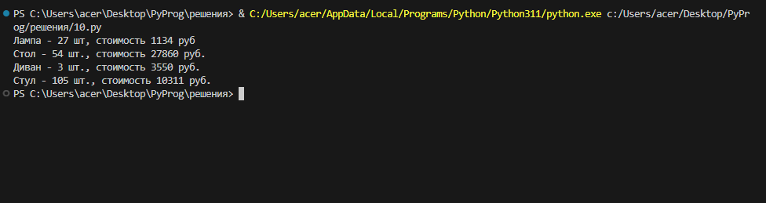

## Список использованных источников 
1. https://docs.python.org/3/tutorial/
