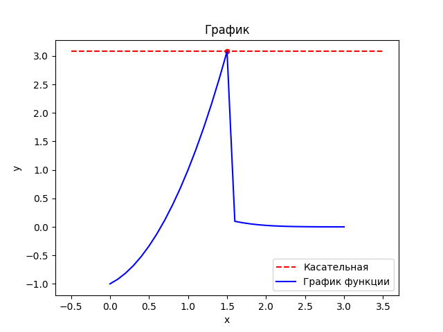

# lab5 
# Задание 
    Сложность:
        Medium
            Постройте все графики с использованием seaborn вместо matplotlib

## Этапы работы
### 1. Код
```python
import matplotlib.pyplot as plt
import seaborn as sns

# Чтение данных из текстового файла
with open('file.txt', 'r') as file:
    data = file.readlines()

# Разделение координат на x и y
x = []
y = []
for line in data:
    line = line.strip().split('\t') 
    x.append(float(line[0]))
    y.append(float(line[1]))

# Касательная к функции
def func(x0):
    return 2**x0 - 2 + x0**2

x0 = 1.5
y0 = func(x0)

# Построение графика
sns.lineplot(x=[x0 - 2, x0 + 2], y=[y0, y0], color='red', linestyle='--', label='Касательная') #создает две точки: одну слева от x0, с координатой x0 - 2, и одну справа от x0, с координатой x0 + 2
sns.scatterplot(x=[x0], y=[y0], color='red') # Точка пересечения
f = sns.lineplot(x=x, y=y, color='Blue', label='График функции')
f.set_title('График')
f.set_xlabel("x")
f.set_ylabel("y")
plt.show()
```

### 2. Результат


### 3. Список использованных источников 
1. [Seaborn](https://habr.com/ru/companies/otus/articles/540526/)