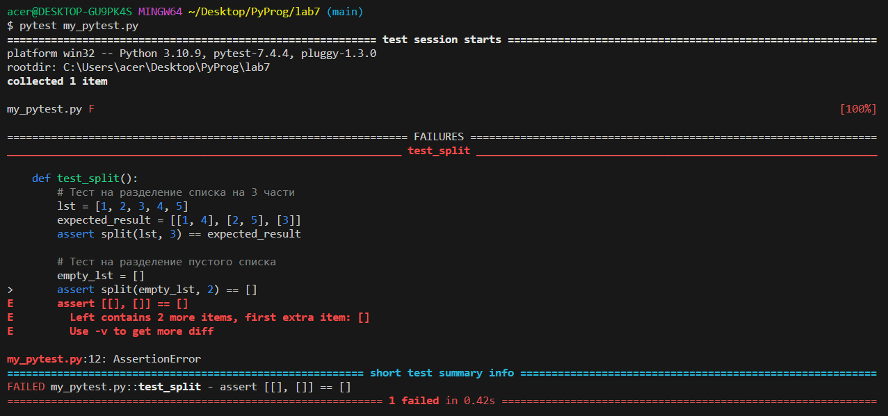

# lab 07

# Задание
    Сложность:
        Medium
            Напишите для своих функций тесты с помощью pytest

# Ход работы
## Код 
```python
def split(lst, n):
    return [lst[i::n] for i in range(n)]

def test_split():
    # Тест на разделение списка на 3 части
    lst = [1, 2, 3, 4, 5]
    expected_result = [[1, 4], [2, 5], [3]]
    assert split(lst, 3) == expected_result

    # Тест на разделение пустого списка
    empty_lst = []
    assert split(empty_lst, 2) == []

    # Тест на разделение списка на 1 часть
    lst_single = [1, 2, 3, 4, 5]
    expected_result_single = [[1, 2, 3, 4, 5]]
    assert split(lst_single, 1) == expected_result_single
```

## Результат


## Список использованных источников
1. [Pytest](https://www.youtube.com/watch?v=VXMECr4_-tE&t=224s)