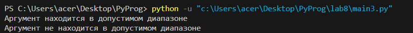

# lab 07

# Задание
    Создайте декоратор с опциональным параметром. Подумайте о поддержке рекурсивных функций.

# Ход работы
## Код 
```python
def check_range(min_val, max_val):
    def decorator(func):
        def wrapper(*args, **kwargs):
            result = func(*args, **kwargs)
            if min_val <= result <= max_val:
                print("Аргумент находится в допустимом диапазоне")
            else:
                print("Аргумент не находится в допустимом диапазоне")
            return result
        return wrapper
    return decorator

@check_range(0, 10)
def my_function(value):
    return value

result = my_function(5)  # Аргумент находится в допустимом диапазоне
result = my_function(15)  # Аргумент не находится в допустимом диапазоне
```

## Результат 


## Список использованных источников 
1. [Декоратор с параметром](https://tirinox.ru/parametric-decorator/)